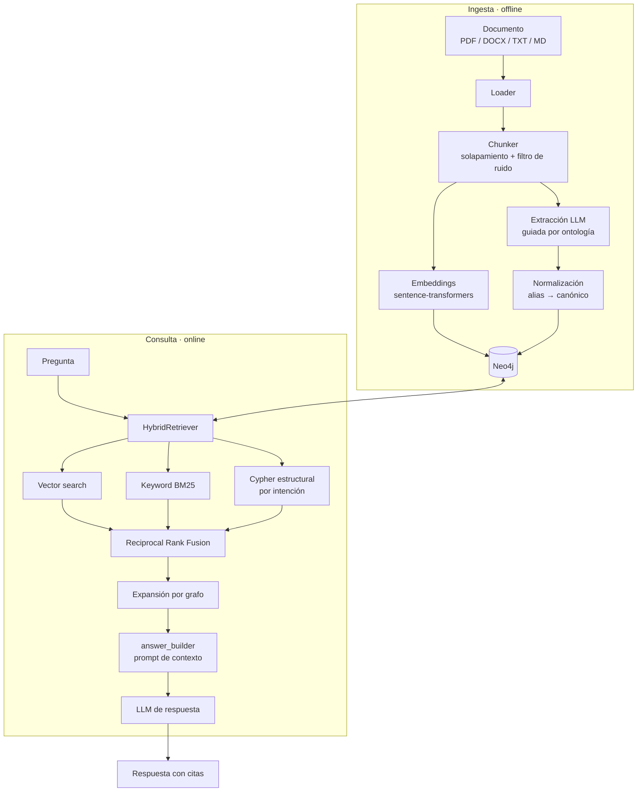
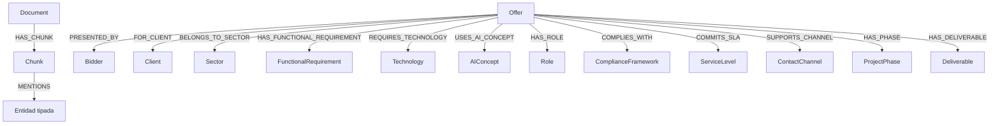
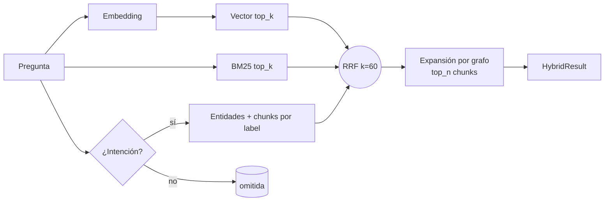

# Arquitectura

Este documento describe el pipeline de extremo a extremo (ingesta → grafo →
recuperación → generación → evaluación), los módulos de `src/ragkg/` y el modelo
de datos del grafo. Todo lo descrito está contrastado con el código.

---

## 1. Visión general

El sistema tiene **dos fases bien separadas**:

- **Ingesta (offline):** convierte documentos en un grafo de conocimiento +
  índices de búsqueda en Neo4j. Es donde se concentra el coste de LLM y donde la
  calidad del modelo más rinde (extracción estructurada). Coste único por
  documento.
- **Consulta (online):** dada una pregunta, recupera contexto combinando cuatro
  estrategias, lo funde con RRF y genera una respuesta con citas.

Sobre ambas se apoya una **capa de evaluación** que mide la calidad del sistema
con un gold por hechos verificables.



---

## 2. Mapa de módulos

```mermaid
flowchart LR
    config[config/loader<br/>DomainConfig] --> ingestion
    config --> extraction
    config --> graph
    config --> evaluation

    subgraph ingestion
        loaders --> chunker --> pipeline
    end
    subgraph extraction
        ontology_extractor
        validators
        normalizer
    end
    subgraph graph
        neo4j_client
        schema
        upsert
        queries
    end
    subgraph embeddings
        embedder
        vector_index
    end
    subgraph retrieval
        vector_retriever
        keyword_retriever
        structured_query
        graph_retriever
        rrf
        hybrid_retriever
    end
    subgraph generation
        answer_builder
    end
    subgraph evaluation
        dataset
        metrics
        judge
        runner
        report
    end

    ingestion --> graph
    extraction --> graph
    embeddings --> graph
    retrieval --> graph
    retrieval --> embeddings
    generation --> retrieval
    evaluation --> retrieval
    evaluation --> generation
```

`config/loader.py` (la clase `DomainConfig`) es el punto central: carga los YAML
del dominio y los expone como API tipada (tipos de entidad, relaciones
permitidas, dirección de cada relación, mapeos de normalización). El resto del
código es **agnóstico al dominio**: no sabe qué es "Java" ni "una oferta".

---

## 3. Ingesta paso a paso

Entrada principal: `scripts/ingest.py` (Typer). Orquestación en
`src/ragkg/ingestion/pipeline.py` (`ingest_path`) + la persistencia de entidades
en `scripts/ingest.py::_extract_and_upsert`.

### 3.1 Carga (`ingestion/loaders.py`)

`load_document` elige loader por extensión:

- **PDF** → `pypdf`; inserta marcas `[PAGE:n]` para poder rastrear el origen.
- **DOCX** → `python-docx` (concatena párrafos no vacíos).
- **TXT / MD** → lectura directa UTF-8.

El `doc_id` es determinista: `sha256(ruta_absoluta)[:12]`. Reingerir el mismo
archivo desde la misma ruta produce el mismo `doc_id` (los `MERGE` de Neo4j hacen
la operación idempotente).

### 3.2 Chunking (`ingestion/chunker.py`)

`chunk_document` trocea el texto en ventanas de `chunk_size` caracteres con
`overlap` de solapamiento. Detalles relevantes:

- **Cortes naturales:** intenta terminar cada chunk en `\n\n`, `\n`, `. ` o
  espacio (en ese orden) para no partir frases, siempre que el corte caiga
  después de la mitad del chunk.
- **Solapamiento:** garantiza que una entidad en el límite entre dos chunks
  aparezca completa en al menos uno.
- **Filtro de bajo valor** (`filter_low_value=True`): descarta chunks que parecen
  índices/ToC (mucho dígito y punto), líneas de relleno (`....`) o fragmentos muy
  cortos (< 80 caracteres). Reduce ruido antes de gastar embeddings y LLM.

### 3.3 Embeddings (`embeddings/embedder.py`)

`Embedder` usa **sentence-transformers** con carga perezosa del modelo (default
`all-MiniLM-L6-v2`, 384 dim, local). `embed_batch` vectoriza todos los chunks en
lote con `normalize_embeddings=True` (para que coseno y producto escalar
coincidan).

### 3.4 Persistencia de chunks (`graph/upsert.py`, vía `pipeline.py`)

Por cada documento: `upsert_document` (nodo `Document`) y, por chunk,
`upsert_chunk` (nodo `Chunk` con su `embedding`) + `link_document_to_chunk`
(relación `Document-[:HAS_CHUNK]->Chunk`). El `metadata` del chunk se **aplana a
primitivos** (`_flatten_to_primitives`) porque Neo4j no admite mapas anidados
como valor de propiedad; de paso, cada campo (`page`, `chunk_index`, ...) queda
consultable desde Cypher.

### 3.5 Extracción guiada por ontología (`extraction/ontology_extractor.py`)

Para cada chunk se construye **dinámicamente** un prompt a partir del dominio
(`build_extraction_prompt`): lista de tipos de entidad y relaciones permitidas,
reglas estrictas y ejemplos few-shot. El LLM devuelve JSON con `entities` y
`relations`. Después se aplica una **cascada de filtros**:

1. **Parseo tolerante** (`_extract_json`): quita fences de markdown y, si hace
   falta, extrae el primer objeto JSON aunque venga con texto alrededor.
2. **Validación Pydantic** (`validators.py`): formato, rangos de `confidence`
   [0,1], `evidence` no vacía.
3. **Filtro anti-basura** (`_is_garbage_entity`): descarta nombres genéricos
   ("sistema", "solución", "API"...), fugas del prompt ("tal cual aparece",
   "nombre canónico"...), nombres demasiado cortos o frases largas (descripciones,
   no entidades).
4. **Filtro por confianza** (`filter_by_confidence`, `MIN_CONFIDENCE`,
   default 0.5): si se cae una entidad, también se caen las relaciones que la
   referencian (no quedan aristas colgando).

> **Reglas notables del prompt:** una sola `Offer` por documento; cada ítem de una
> lista enumerada (RF01, RF02...) es una entidad **separada** (con atención al
> primero, que se omite a menudo); y las entidades con código usan el **código
> como `canonical_name`** (`"RF 09"` → `RF09`), con el título descriptivo en
> `name`/`properties.title`.

### 3.6 Normalización (`extraction/normalizer.py`)

`EntityNormalizer` construye un índice invertido `alias → nombre_canónico` por
categoría a partir de `normalization.yaml`, y mapea cada **tipo** de entidad a su
categoría mediante la clave reservada `_type_to_category` del propio YAML (con
fallback a un default en código). Así, `dotnet`/`asp.net` → `.NET`, `k8s` →
`Kubernetes`, etc. Un tipo sin categoría se devuelve "limpio" (sin canonicalizar).

### 3.7 Persistencia de entidades y relaciones (`scripts/ingest.py`)

Por cada entidad superviviente:

- `upsert_entity` con **label dinámico** (validado por whitelist con `_ensure_safe`
  contra inyección Cypher) y su `id_field` (de la ontología).
- Para entidades cuyo `id_field` es `canonical_name`, se guarda el nombre
  normalizado. **Las entidades con `code` (p. ej. `FunctionalRequirement`) se
  identifican por `code`, no por `canonical_name`** — esto es deliberado (ver
  [decisiones](04-decisiones-y-limitaciones.md)).
- `link_chunk_mentions_entity`: crea `Chunk-[:MENTIONS]->Entidad` con `evidence`
  y `confidence` (trazabilidad texto↔grafo).

Por cada relación se valida que: el tipo exista en `relations.yaml`, ambos
extremos se hayan persistido, y la **dirección** `source→target` esté permitida
(`is_relation_allowed`). Solo entonces `upsert_relation` la escribe.

---

## 4. Esquema de grafo (`graph/schema.py`)

`create_schema` (idempotente) crea tres cosas:

- **Constraints de unicidad** para cada `id_field` de cada entidad de la
  ontología (p. ej. `Offer.offer_id`, `Technology.canonical_name`,
  `FunctionalRequirement.code`).
- **Índice vectorial** `chunk_embedding` sobre `Chunk.embedding` (dimensión de
  `EMBEDDING_DIMENSIONS`, similitud coseno).
- **Índice full-text** `chunk_text` sobre `Chunk.text` (para BM25).

### Modelo de datos (dominio `offers`)



El grafo tiene dos "capas" unidas por `MENTIONS`:

- **Capa documental:** `Document → Chunk` (texto + embedding).
- **Capa de conocimiento:** entidades tipadas y sus relaciones, extraídas del
  texto.

`Chunk-[:MENTIONS]->Entidad` (con `evidence` y `confidence`) es lo que hace el
sistema **explicable**: toda entidad puede rastrearse al fragmento que la
justifica. El catálogo completo de entidades y relaciones está en
`configs/domains/offers/ontology.yaml` y `relations.yaml`
(ver [configuración por dominio](02-configuracion-por-dominio.md)).

---

## 5. Recuperación híbrida (`retrieval/`)

Entrada: `scripts/query.py` → `HybridRetriever.retrieve`
(`retrieval/hybrid_retriever.py`). Se ejecutan hasta **cuatro estrategias** y se
fusionan:

| # | Estrategia | Módulo | Qué aporta |
|---|---|---|---|
| 1 | **Vectorial** | `vector_retriever.py` → `vector_index.py` | Chunks semánticamente parecidos a la pregunta (índice vectorial Neo4j) |
| 2 | **Keyword (BM25)** | `keyword_retriever.py` | Chunks que contienen los términos (índice full-text; sanea caracteres Lucene; ante fallo devuelve vacío, no rompe) |
| 3 | **Cypher estructural** | `structured_query.py` | Si detecta **intención** (regex sobre la pregunta → tipo de entidad objetivo), consulta el grafo directamente y trae entidades + sus chunks de evidencia |
| 4 | **Expansión por grafo** | `graph_retriever.py` | Sobre los chunks ganadores, recupera las entidades que mencionan y sus vecinos directos |

### Fusión con RRF (`retrieval/rrf.py`)

Las estrategias 1–3 producen rankings de chunks que se fusionan con **Reciprocal
Rank Fusion** (Cormack et al., 2009): `RRF(d) = Σ 1/(k + rank_i(d))`, con `k=60`.
RRF combina rankings **sin** normalizar scores (solo usa la posición), lo que lo
hace robusto a fuentes con escalas de score distintas. El resultado anota
`rrf_score`, `sources` (de qué estrategias vino) y `ranks` por estrategia.

Sobre los `expand_top_n` chunks fusionados se ejecuta la expansión por grafo (4)
para enriquecer el contexto.



La detección de intención (`detect_intent`) cubre tecnologías, certificaciones,
cumplimiento (ENS/GDPR/OWASP...), metodologías, roles, sectores, canales, SLA,
entregables, fases, requisitos funcionales, ofertantes, clientes y conceptos de
IA. Si no hay intención reconocible, se usan solo vector + keyword.

---

## 6. Generación (`generation/answer_builder.py`)

`build_context_prompt` arma el prompt final para el LLM de respuesta con:

- Los chunks fusionados (RRF) con su procedencia (`vec`/`key`/`struct`).
- Las entidades relacionadas del grafo (agrupadas por tipo).
- Si hubo consulta estructural exitosa, un bloque de **"respuesta estructural
  directa del grafo"** que el prompt instruye a **priorizar** (viene de extracción
  validada).
- Instrucciones de responder **solo** con el contexto y **citar los chunks**
  usados (`Chunk N`).

`scripts/query.py` llama después al LLM (`build_llm_client(json_mode=False)`,
modelo `LLM_MODEL`). Con `--raw` se omite el LLM y se muestra solo el contexto;
con `--json` la salida es estructurada (`build_answer_summary`).

---

## 7. Evaluación (resumen)

La capa de evaluación reutiliza la recuperación y la generación reales como caja
negra (`answer_fn`) y mide la calidad con un gold por hechos. Tiene su propio
documento: [`03-evaluacion.md`](03-evaluacion.md).

---

## 8. Proveedores LLM y cliente (`extraction/ontology_extractor.py`)

Un único cliente (`OpenAICompatibleClient`) sirve a OpenAI y a cualquier API
compatible. `build_llm_client` resuelve el proveedor desde `LLM_PROVIDER`:

- **`openai`** — proveedor por defecto del proyecto (la empresa usa OpenAI).
- **`groq`** y **`openrouter`** — compatibles OpenAI (mismo SDK, distinto
  `base_url`); útiles para modelos baratos.
- **`mock`** — `MockLLMClient`, devuelve extracción vacía; para validar el
  pipeline sin gastar tokens (y en tests).

Detalles de robustez: reintentos con backoff exponencial que respetan el
`Retry-After`/mensaje de rate limit (clave para tiers gratuitos), manejo de
modelos "razonadores" de OpenAI (`gpt-5`, `o1/o3/o4`: usan
`max_completion_tokens` y no aceptan `temperature`), y detección de salida
truncada (`finish_reason=length`) con un error accionable en lugar de un fallo
críptico de parseo.
