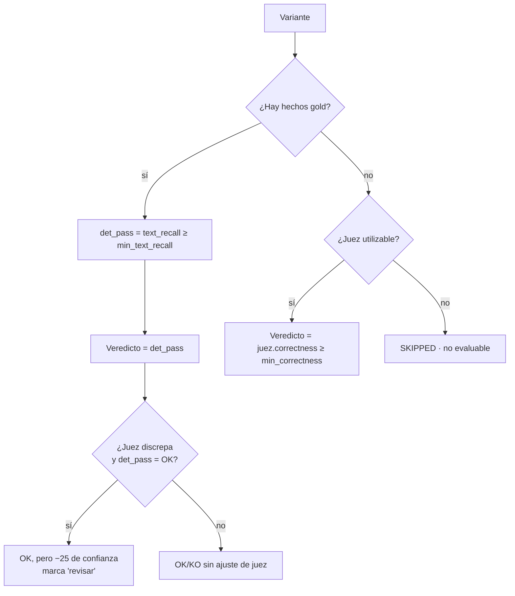

# La capa de evaluación

La evaluación responde a una pregunta incómoda: *¿cómo sabes que el sistema
contesta bien sin leer cada respuesta a mano?* La respuesta de este proyecto es
una capa **determinista-primero**: un gold por **hechos verificables** que se
comprueban sin LLM, con un **juez LLM como apoyo** (no como veto). Este documento
explica el scoring, las métricas y cómo se lee un run.

Código: `src/ragkg/evaluation/` · Entrada: `scripts/evaluate.py` · Rúbrica:
`configs/domains/offers/eval_rubric.yaml` · Datasets:
`src/ragkg/evaluation/test_queries.yaml` (calibrado) y `test_queries_full.yaml`
(corpus amplio).

---

## 1. Idea central: gold por hechos ("opción A")

Cada caso de evaluación lleva una lista de **hechos verificables**
(`expected_entities`): entidades por `name`, `code`, `metric` o `value`. En lugar
de exigir una respuesta textual exacta, se comprueba si esos hechos **aparecen**.

```yaml
- id: q1_entelgy_rf
  type: factoid
  question: "¿Qué requisitos funcionales aborda la oferta de Entelgy?"
  paraphrases:
    - "¿Qué RF cubre la propuesta de Entelgy?"
    - "Dime los requisitos funcionales que atiende la oferta de Entelgy."
    # ... (paráfrasis CONGELADAS para medir robustez al fraseo)
  expected_entities:
    - { type: Bidder, name: "Entelgy" }
    - { type: FunctionalRequirement, code: "RF01" }
    - { type: FunctionalRequirement, code: "RF09" }
```

Cada caso tiene la **pregunta original + paráfrasis congeladas** (no se generan en
caliente: así el run es reproducible y mide robustez al fraseo).

---

## 2. La capa determinista (`metrics.py`)

El recall de hechos se mide sobre **dos superficies distintas**, y comparar ambas
es lo que permite **localizar el fallo**:

| Superficie | Función | Pregunta que responde |
|---|---|---|
| **Texto de la respuesta** | `fact_recall_in_text` | ¿El modelo lo **dijo**? |
| **Entidades recuperadas** | `fact_recall_in_entities` | ¿El retrieval lo **trajo**? |

El matching es deliberadamente tolerante, para no penalizar formas legítimas:

- **Alias:** reutiliza `normalization.yaml` del dominio (`build_alias_index`), así
  un hecho gold `.NET` casa con `dotnet`/`asp.net`, o `RFT` con
  `reinforcement fine-tuning`.
- **Formato:** casa por substring normalizado (minúsculas, espacios colapsados) y,
  además, por versión **sin espacios** para códigos: `"RF 01"` ≈ `RF01`.
- En entidades, el substring se comprueba en **ambos sentidos** (el hecho dentro
  de la entidad y viceversa).

Además, un chequeo barato de **grounding** (`grounding_check`): extrae las citas
`Chunk N` de la respuesta y verifica que apunten a chunks que existen en el
contexto. Una cita a un chunk inexistente es señal de fuente alucinada.

---

## 3. El juez LLM (`judge.py`) — apoyo, no veto

El juez puntúa la respuesta por una rúbrica (**correctness**, **completeness**,
**faithfulness**, 0–100) y emite un veredicto con justificación y `failure_locus`.
Pero **no es la última palabra**. Es deliberado, y la razón está en el código:

> Política calibrada para un **juez débil** (modelo pequeño): con gold
> determinista, **manda el determinista**. El juez **no puede convertir un OK
> determinista en KO** — solo baja la confianza y deja una marca de "revisar".
> Sin gold (casos abiertos), el veredicto sí recae en el juez.

El motivo: un juez pequeño genera demasiados **falsos negativos**. Si pudiera
vetar, tiraría respuestas correctas. Por eso, cuando hay hechos gold, el juez solo
**resta confianza** si discrepa (sospecha de *faithfulness*), nunca invierte el
veredicto.

El juez además se ignora si no devuelve un JSON válido o si se abstiene
(`ABSTAIN`): su voto solo cuenta si es utilizable.

> **Recomendación de configuración** (`eval_rubric.yaml` / `.env`): el juez debería
> ser un modelo **distinto** del respondedor para reducir sesgo de
> autoevaluación. El diseño de coste del proyecto usa un modelo **pequeño/barato**
> como juez (`JUDGE_LLM_MODEL`). En el MVP el juez corrió con `gpt-5.4-mini`, el
> mismo que el respondedor — algo a corregir para evitar autoevaluación.

---

## 4. Cómo se combina todo (`runner.py`)

Para cada **variante** (pregunta original o paráfrasis), `evaluate_variant`
decide así:



Reglas, en orden:

1. **Con gold determinista:** `passed = (text_recall ≥ min_text_recall)`. El juez
   solo puede vetar "de mentira": si el juez falla y el determinista dice OK, se
   marca `judge_vetoes` → la confianza baja, el veredicto **sigue OK**.
2. **Sin gold (caso abierto):** el veredicto recae en el juez (`correctness ≥
   min_correctness`).
3. **Sin gold y sin juez utilizable:** `SKIPPED` (no evaluable).

### Confianza anclada

- Con gold: `confidence = round(text_recall * 100)`; −25 si el juez discrepa; −15
  si el grounding falla.
- Sin gold pero con juez: media de `correctness` y `confidence` del juez.
- (La función `_anchored_confidence` promedia recall determinista y `correctness`
  del juez cuando ambos existen.)

### Localización del fallo (`failure_locus`)

Cuando una variante es KO, se etiqueta **dónde** falló comparando las dos
superficies (`_derive_locus`):

- **`retrieval`** — el hecho no se recuperó del grafo (ni en texto ni en
  entidades).
- **`generation`** — el hecho **sí** estaba recuperado, pero la respuesta no lo
  usó.
- **`none`** — la variante pasó.

En casos abiertos sin determinista, el locus lo decide el juez.

---

## 5. Agregación por caso y por dataset

**Por caso** (`evaluate_case`): se evalúan todas las variantes y se agrega:

- **`pass_rate`** = fracción de variantes evaluables que dan OK.
- **Veredicto del caso** = OK si `pass_rate ≥ min_pass_rate` (default 0.6, ≈
  mayoría de 5 variantes).
- **`consistent`** = `True` si todas las variantes coinciden en veredicto (mide
  robustez al fraseo: un caso puede ser OK pero inconsistente si alguna paráfrasis
  falla).
- **`mean_confidence`** = media de confianza de las variantes evaluables.

**Por dataset** (`run_evaluation`):

- **`accuracy`** = casos OK / casos evaluados (excluye SKIPPED).
- **`consistency_rate`** = fracción de casos consistentes.
- **`mean_confidence`** = media de la confianza media por caso.

---

## 6. Anatomía de un run

`make eval` imprime una tabla (Rich) y guarda el run completo en
`data/eval_runs/eval_<dominio>_<timestamp>.json`. Ejemplo real (resumen de un run
del dominio `offers`, dataset v0.5.0, 11 casos):

```json
"meta":    { "answer_model": "gpt-5.4-mini", "judge_model": "gpt-5.4-mini",
             "top_k": 15, "max_context_chunks": 5, "chunk_size": "1200" },
"summary": { "total_cases": 11, "scored_cases": 11, "skipped_cases": 0,
             "ok": 11, "ko": 0, "accuracy": 1.0,
             "consistency_rate": 0.818, "mean_confidence": 77 }
```

Y una variante de `q1_entelgy_rf` ilustra la política juez-como-apoyo:

```text
verdict: OK · confidence: 75 · text_recall: 1.0 · graph_recall: 0.67 · locus: none
justification: "OK determinista (presentes: ['Entelgy','RF01','RF09']);
                el juez discrepa: ..."
```

Lectura:

- **accuracy 1.0** — los 11 casos pasaron el umbral determinista.
- **consistency 0.818** — ~2 de 11 casos tuvieron alguna paráfrasis discrepante
  (OK como caso, pero no unánime).
- **confidence 77** — anclada al recall determinista, con ajustes del juez.
- En la variante, `text_recall=1.0` (los tres hechos aparecen en la respuesta)
  pero `confidence=75`: el juez discrepó (sospecha de faithfulness) y restó, **sin
  cambiar el OK**. Esto es exactamente el diseño determinista-primero en acción.

> **Cómo interpretar combinaciones típicas:**
> - `OK` + `consistent ✓` + confianza alta → caso sólido.
> - `OK` + `consistent ✗` → correcto pero frágil al fraseo; revisar paráfrasis.
> - `KO` + `locus=retrieval` → problema de recuperación/ingesta (el hecho no está
>   en el grafo o no se recuperó). Mira la ingesta y la normalización.
> - `KO` + `locus=generation` → el contexto estaba, el modelo no lo usó. Mira el
>   prompt de respuesta o el modelo.
> - `SKIPPED` → caso sin gold y sin juez utilizable; añade hechos gold o activa el
>   juez.

---

## 7. Los casos q10/q11: gold mínimo e innegable

Los casos `q10` (agregado: "tecnologías más relevantes") y `q11` (similitud) eran
"abiertos" y dependían del juez. Se les añadió un **gold mínimo e innegable**: solo
los hechos que **cualquier** respuesta correcta debe contener, verificados contra
el grafo.

```yaml
- id: q10_top_technologies
  type: aggregate
  expected_entities:
    - { type: Technology, name: "Azure OpenAI" }
    - { type: Technology, name: "Azure AI Search" }
    - { type: AIConcept,  name: "RAG" }
```

Con `min_text_recall=0.5`, basta con que aparezcan **2 de 3**. Así estos casos
**dejan de depender del juez** sin volverse frágiles: no se exige exhaustividad
(sería injusto en un agregado), solo un núcleo innegable. Es el patrón
recomendado para convertir preguntas abiertas en evaluables de forma determinista.

---

## 8. Ejecutar la evaluación

```bash
# Completa, con juez (necesita LLM configurado)
make eval
python scripts/evaluate.py --domain offers

# Rápida: solo determinista, 3 casos, con detalle por paráfrasis (sin tokens)
make eval-quick
python scripts/evaluate.py --no-judge --limit 3 --variants

# Casos concretos / modelo de juez concreto
python scripts/evaluate.py --only q1_entelgy_rf,q10_top_technologies --variants
python scripts/evaluate.py --judge-model <modelo_pequeño>

# Corpus amplio (requiere haber ingerido varias ofertas)
python scripts/evaluate.py --dataset-path src/ragkg/evaluation/test_queries_full.yaml
```

Flags útiles: `--no-judge` (solo determinista), `--limit N`, `--only ids`,
`--variants` (detalle por paráfrasis), `--no-save` (no escribir el JSON),
`--top-k`, `--max-context-chunks`.

---

## 9. Umbrales (resumen)

Definidos en `configs/domains/offers/eval_rubric.yaml` (`Thresholds.from_config`):

| Umbral | Default | Significado |
|---|---|---|
| `min_text_recall` | 0.5 | Fracción de hechos gold en la **respuesta** para OK determinista |
| `min_correctness` | 60 | `correctness` mínimo del juez (cuando decide, en casos abiertos) |
| `min_pass_rate` | 0.6 | Fracción de variantes que deben pasar para que el **caso** sea OK |

Cambiar de dominio = editar este YAML, no el código.
