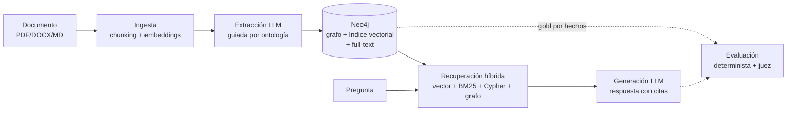

# RAG-KG Prototype

Plataforma **agnóstica de RAG enriquecido con grafo de conocimiento** (GraphRAG).
Extrae entidades y relaciones de documentos (PDF, DOCX, TXT/MD) guiada por una
**ontología configurable por dominio**, las persiste en **Neo4j**, y responde
preguntas con **recuperación híbrida** (vectorial + keyword + consulta
estructurada al grafo + expansión por grafo, fusionadas con RRF). Incluye una
**capa de evaluación propia** determinista-primero, con un LLM-as-judge opcional.

> **Principio de diseño:** cambiar de dominio sin tocar código Python. Todo el
> conocimiento de negocio vive en `configs/domains/<dominio>/`.

El dominio de referencia es **`offers`**: ofertas técnicas / pliegos de licitación
(perfiles, tecnologías, requisitos funcionales, SLA, cumplimiento, etc.).

---

## Qué problema resuelve

Un RAG vectorial clásico responde bien a "¿de qué habla este documento?" pero
falla en preguntas estructuradas sobre ofertas técnicas: *"¿qué requisitos
funcionales cubre?"*, *"¿qué SLA promete para incidencias críticas?"*, *"¿usa RAG
sobre Azure OpenAI?"*. Estas preguntas se responden mejor consultando un **grafo**
de entidades tipadas (con su evidencia textual) que recuperando trozos de texto.

Este proyecto combina ambos mundos: indexa el texto **y** construye el grafo, y
en consulta fusiona varias estrategias de recuperación para aprovechar lo mejor
de cada una.

---

## Arquitectura en un vistazo



Detalle completo del pipeline y los módulos en
[`docs/01-arquitectura.md`](docs/01-arquitectura.md).

---

## Requisitos

- **Python 3.11+**
- **Docker** y **Docker Compose** (para Neo4j)
- Una **API key de OpenAI** si vas a usar extracción/respuesta con LLM
  (el proveedor por defecto del proyecto es OpenAI; ver
  [Configuración](#configuración)). Para validar el pipeline sin gastar tokens
  existe el proveedor `mock`.

Dependencias principales (ver `pyproject.toml`): `neo4j`, `pydantic`, `pyyaml`,
`sentence-transformers`, `openai`, `pypdf`, `python-docx`, `typer`, `rich`.

---

## Instalación

```bash
cd rag-kg-prototype

# Entorno virtual
python -m venv .venv
source .venv/bin/activate          # Windows: .venv\Scripts\activate

# Dependencias (modo editable + extras de desarrollo)
make install                       # equivale a: pip install -e ".[dev]"

# Variables de entorno
cp .env.example .env               # y edita .env con tus credenciales
```

---

## Configuración

La configuración vive en dos planos:

- **`.env`** — secretos y parámetros de runtime (Neo4j, proveedor/modelo LLM,
  embeddings, chunking). Está en `.gitignore`; nunca se commitea.
- **`configs/`** — conocimiento (base + por dominio), versionado en el repo.

### `.env` (claves principales)

| Variable | Para qué sirve | Valor de referencia |
|---|---|---|
| `NEO4J_URI` / `NEO4J_USER` / `NEO4J_PASSWORD` / `NEO4J_DATABASE` | Conexión a Neo4j | `bolt://localhost:7687` / `neo4j` / `password` / `neo4j` |
| `EMBEDDING_MODEL` / `EMBEDDING_DIMENSIONS` | Modelo de embeddings (local) | `sentence-transformers/all-MiniLM-L6-v2` / `384` |
| `LLM_PROVIDER` | `mock` \| `openai` \| `groq` \| `openrouter` | `openai` |
| `LLM_MODEL` | Modelo para **extracción** (ingesta) y **respuesta** | `gpt-5.4-mini` (MVP) |
| `LLM_API_KEY` | API key del proveedor (OpenAI) | *(secreto)* |
| `JUDGE_LLM_MODEL` | Modelo del **juez** de evaluación (separable) | un modelo pequeño/barato |
| `LLM_TEMPERATURE` / `LLM_MAX_TOKENS` | Parámetros de generación | `0.0` / `8000` |
| `LLM_CHUNK_DELAY_SECONDS` | Pausa entre llamadas (útil en tiers con rate limit) | `0` |
| `DOMAIN` | Dominio por defecto | `offers` |
| `MIN_CONFIDENCE` | Umbral de confianza para persistir entidades/relaciones | `0.5` |

> **Coste por modelo.** La ingesta y la respuesta leen ambas `LLM_MODEL`, pero
> son **invocaciones separadas** que cargan el `.env` en cada ejecución. El diseño
> de coste recomendado es: modelo **potente** en la fase de ingesta (extracción
> estructurada, coste único) y modelo **pequeño/barato** en respuesta y en el juez
> (`JUDGE_LLM_MODEL`). En el MVP todo corrió con `gpt-5.4-mini`. Ver el
> razonamiento en [`docs/04-decisiones-y-limitaciones.md`](docs/04-decisiones-y-limitaciones.md).
>
> **Nota:** el chunking se controla con los flags `--chunk-size` / `--overlap` de
> `scripts/ingest.py` (defaults 1200 / 200). La variable `CHUNK_SIZE` del `.env`
> **no** la lee el script de ingesta hoy; ver limitaciones.

### Neo4j vía Docker Compose

```bash
make neo4j-up                      # docker compose up -d
# Browser:  http://localhost:7474   (neo4j / password)
# Bolt:     bolt://localhost:7687
make neo4j-logs                    # ver logs
make neo4j-down                    # detener
```

El `docker-compose.yml` levanta **Neo4j 5** con el plugin **APOC** y volúmenes
persistentes (`neo4j_data`, `neo4j_logs`, etc.).

---

## Puesta en marcha (end-to-end)

```bash
# 1. Levantar Neo4j y verificar conexión
make neo4j-up
make check                         # "Conexión OK"

# 2. Crear constraints + índice vectorial + índice full-text (idempotente)
make schema                        # usa DOMAIN del .env (offers)

# 3. Ingerir la oferta de muestra (PDF de Entelgy)
make ingest-sample                 # o: make ingest FILE=ruta/a/tu_oferta.pdf

# 4. Consultar
make query Q="¿Qué requisitos funcionales aborda la oferta?"

# 5. Evaluar
make eval                          # con juez LLM
make eval-quick                    # solo capa determinista, 3 casos, sin juez
```

---

## Comandos clave (`make`)

| Comando | Qué hace |
|---|---|
| `make install` | Instala dependencias en modo editable + dev |
| `make neo4j-up` / `neo4j-down` / `neo4j-logs` | Gestiona Neo4j en Docker |
| `make check` | Verifica la conexión a Neo4j |
| `make schema` | Crea constraints + índice vectorial + full-text (idempotente) |
| `make reset` | Vacía toda la base de datos (pide confirmación) |
| `make ingest-sample` | Ingiere `SAMPLE_FILE` (por defecto el PDF de Entelgy) |
| `make ingest FILE=ruta` | Ingiere un archivo o directorio concreto |
| `make query Q="..."` | Lanza una consulta híbrida |
| `make eval` | Evaluación end-to-end con juez LLM |
| `make eval-quick` | Evaluación determinista, 3 casos, sin juez (`--no-judge --limit 3 --variants`) |
| `make test` | Ejecuta los tests (`pytest`) |
| `make lint` / `make format` | `ruff` |
| `make clean` | Elimina cachés |

> Los scripts también se invocan directamente: `python scripts/ingest.py …`,
> `python scripts/query.py …`, `python scripts/evaluate.py …`. Cada uno expone
> su `--help` (Typer). Los *entry points* `ragkg-ingest` / `ragkg-query` de
> `pyproject.toml` **no** funcionan actualmente (ver limitaciones); usa `scripts/`
> o `make`.

---

## Estructura del proyecto

```
rag-kg-prototype/
├── configs/
│   ├── base/                 # pipeline.yaml, llm.yaml, embeddings.yaml
│   └── domains/
│       ├── generic/          # dominio mínimo de ejemplo (plantilla)
│       └── offers/           # dominio de ofertas técnicas (referencia)
├── data/
│   ├── samples/              # Entelgy_Oferta_tecnica.pdf
│   ├── raw/  processed/       # datos (ignorados en git)
│   └── eval_runs/            # artefactos JSON de cada evaluación
├── src/ragkg/
│   ├── config/               # carga y validación de YAML
│   ├── ingestion/            # loaders, chunker, pipeline
│   ├── extraction/           # extractor por ontología, validators, normalizer
│   ├── graph/                # cliente Neo4j, schema, upserts, queries
│   ├── embeddings/           # embedder, helper de índice vectorial
│   ├── retrieval/            # vector + keyword + structured + grafo + RRF + híbrido
│   ├── generation/           # answer_builder (prompt de contexto)
│   └── evaluation/           # dataset, metrics, judge, runner, report, test_queries*.yaml
├── scripts/                  # CLIs (ingest, query, evaluate, schema, check, reset)
├── tests/                    # tests unitarios (pytest)
└── docs/                     # esta documentación
```

---

## Documentación

| Documento | Contenido |
|---|---|
| [`docs/00-indice.md`](docs/00-indice.md) | Mapa de la documentación |
| [`docs/01-arquitectura.md`](docs/01-arquitectura.md) | Pipeline end-to-end, diagramas de flujo y módulos, modelo de datos del grafo |
| [`docs/02-configuracion-por-dominio.md`](docs/02-configuracion-por-dominio.md) | Cómo añadir/editar un dominio con los YAML de `configs/` |
| [`docs/03-evaluacion.md`](docs/03-evaluacion.md) | La capa de evaluación: scoring determinista + juez, métricas e interpretación |
| [`docs/04-decisiones-y-limitaciones.md`](docs/04-decisiones-y-limitaciones.md) | Decisiones de diseño y limitaciones conocidas (apartado honesto) |
| [`docs/CHANGELOG.md`](docs/CHANGELOG.md) | Cambios del dominio `offers` |
| [`docs/PHASES.md`](docs/PHASES.md) | Fases de implementación y notas de arquitectura |

---

## Cambiar de dominio (resumen)

1. Copia `configs/domains/generic/` → `configs/domains/mi_dominio/`.
2. Edita los YAML (ontología, relaciones, normalización, definiciones, esquema y
   `eval_rubric.yaml`). Solo YAML, nada de Python.
3. `DOMAIN=mi_dominio` en `.env`.
4. `make schema && make ingest FILE=mi_documento.pdf`.

Guía detallada: [`docs/02-configuracion-por-dominio.md`](docs/02-configuracion-por-dominio.md).

---

## Licencia

MIT (ajustar según necesidad).
